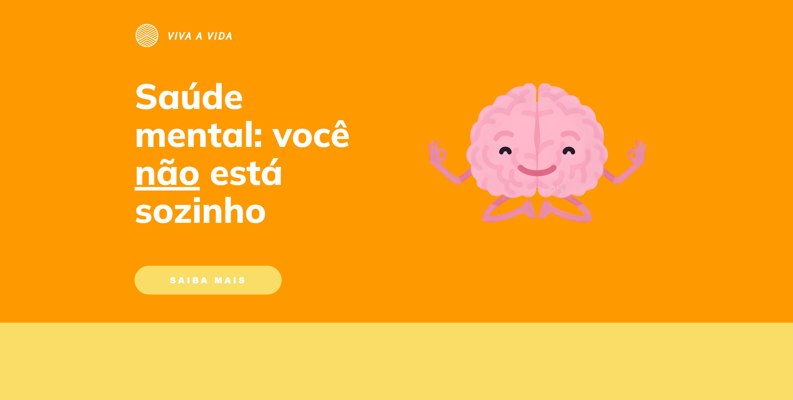

<h1 align="center"> Saúde Mental </h1>

Projeto desenvolvido durante um projeto com cunho social do itinerário STEAM, SESI-SENAI. 🚀🔥

  <a href="#-tecnologias">Tecnologias</a>&nbsp;&nbsp;&nbsp;|&nbsp;&nbsp;&nbsp;
  <a href="#-projeto">Projeto</a>&nbsp;&nbsp;&nbsp;|&nbsp;&nbsp;&nbsp;
  <a href="#-links">Links</a>

 

  

> Projetos Livres

A matéria possui como principal objetivo desenvolver um projeto aplicando nossos conhecimentos e interesses, desde que tenha alguma aplicação social. Ele foi essencial para o aprendizado das linguagens utilizadas, visto que foi um dos meus primeiros projetos com objetivos externos e 100% autoral. 💻❤️

## 🚀 Tecnologias

Esse projeto foi desenvolvido com as seguintes tecnologias:

- HTML 
- CSS
- Git & Github

   

## 💻 Projeto

Utiliza de tecnologias e linguagens básicas do navegador para apresentar um site informativo, desenvolvido com o objetivo de facilitar o acesso às informações verdadeiras das doenças mentais pós-pandemia. Além disso, possui dicas e depoimentos que ajudam pessoas portadoras destes problemas a lidarem com os mesmos e se sentirem mais tranquilas.

## 🔗 Links

) 
